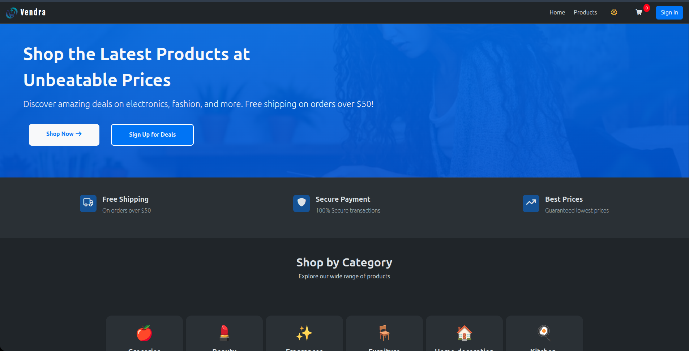
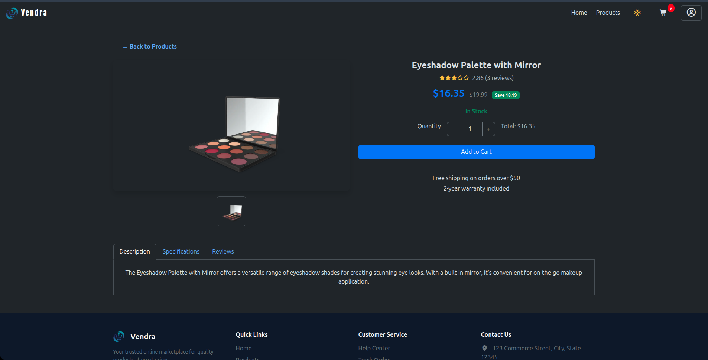
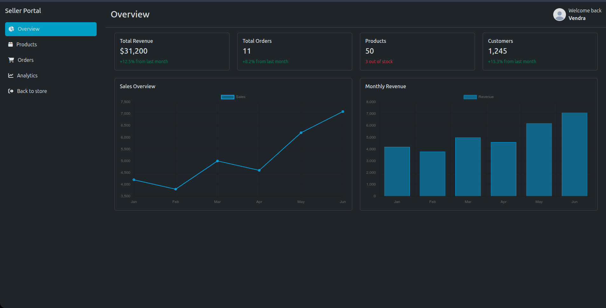
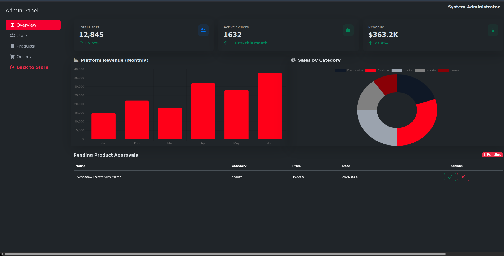
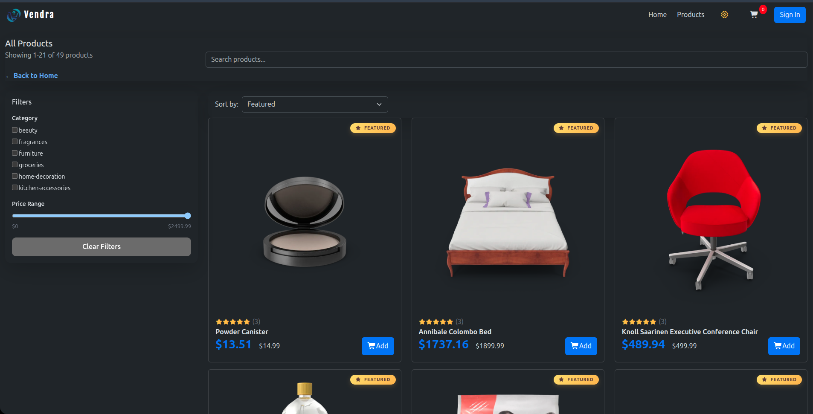
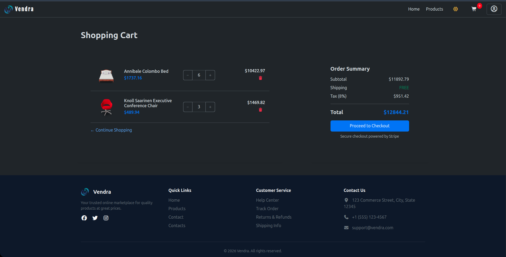

---

## 📑 Table of Contents

- [Overview](#-overview)
- [Features](#-features)
- [User Roles](#-user-roles)
- [Tech Stack](#-tech-stack)
- [Project Structure](#-project-structure)
- [Getting Started](#-getting-started)
- [Usage](#-usage)
- [Screenshots](#-screenshots)
- [Architecture](#-architecture)
- [Data & Storage](#-data--storage)
- [Roadmap](#-roadmap)
- [Team](#-team)
- [License](#-license)

---

## 🔍 Overview

**Vendra** is a front-end web application that simulates a fully functional,
multi-role e-commerce marketplace. It demonstrates client-side architecture,
role-based access control, and dynamic state management — all without a backend
server or database.

All data is persisted using **Browser Local Storage**, managed through a
structured layer of Models, Services, and a centralised Storage utility —
simulating a backend ORM-like pattern entirely on the client side.
---

## ✨ Features

### 🔐 Authentication & Access Control

- Role-based login and registration (Customer, Seller, Admin)
- Actor role selection at sign-up
- Automatic dashboard redirection based on authenticated role
- Route protection with automatic redirect to login on unauthorised access

### 🏠 Home Page

- Featured products showcase
- Promotions and category previews
- Fully responsive Bootstrap layout

### 🛍️ Product Catalogue

- Grid and list view modes
- Product cards with images, names, prices, and ratings
- Keyword search and category filtering
- Add-to-Cart directly from catalogue

### 📦 Product Details

- Full product descriptions and image gallery
- Pricing and available options
- Seamless navigation back to the catalogue

### 🛒 Shopping Cart

- Add, remove, and adjust product quantities
- Real-time subtotal and grand total calculation
- Order summary preview before checkout

### 💳 Checkout

- Shipping information form
- Payment details input
- Final order review and purchase confirmation

### 📊 Seller Dashboard

- Add, edit, and delete product listings
- Manage and track incoming customer orders
- Sales performance analytics

### 🛡️ Admin Panel

- Full platform administration access
- User account management (view, edit, remove, change roles)
- Product moderation (approve or remove listings)
- Customer support and complaint handling

### 🎨 UI / UX Enhancements

- **Light / Dark Mode** toggle with persisted preference
- **Toast Notifications** for real-time action feedback
- **Image Caching** for improved product image performance
- **Seeded Data** for immediate demonstration without manual setup
- Fully **responsive** across mobile, tablet, and desktop

---

## 👥 User Roles

Vendra supports three distinct actors, each with a dedicated dashboard and
controlled permissions:

| Role         | Access Level | Key Capabilities                                                             |
| ------------ | ------------ | ---------------------------------------------------------------------------- |
| **Customer** | Limited      | Browse catalogue, add to cart, checkout, view order history, manage profile  |
| **Seller**   | Moderate     | Manage own products, process orders, view sales analytics                    |
| **Admin**    | Full         | Manage all users, moderate products, handle support, oversee system activity |

---

## 🛠️ Tech Stack

| Category                  | Technology            |
| ------------------------- | --------------------- |
| **Markup**                | HTML5                 |
| **Styling**               | CSS3, Bootstrap 5     |
| **Logic & Interactivity** | JavaScript (ES6+)     |
| **Data Persistence**      | Browser Local Storage |
| **UI/UX Prototyping**     | Figma                 |
| **Version Control**       | Git & GitHub          |
| **Deployment**            | GitHub Pages          |
| **Project Management**    | Jira (Scrum)          |

---

## 📁 Project Structure

```
MULTI-ACTOR-E-COMMERCE-SYSTEM/
│
├── index.html                  # Landing page & role selection entry point
│
├── admin/                      # Admin dashboard (HTML, JS, CSS)
├── seller/                     # Seller dashboard (HTML, JS, CSS)
├── user/                       # Customer-facing pages (HTML, JS, CSS)
│
├── components/
│   ├── common/                 # Shared components (navbar, footer, cards, modals)
│   ├── user/                   # Customer-specific components
│
├── assets/                     # Static assets (images, icons, stylesheets)
│
├── DataBase/                   # Models, services, and seed data
│   ├── models/                 # User, Product, Cart, Order models
│   ├── services/               # userService, productService, cartService, orderService
│   └── seed/                   # Preloaded demo data
│
├── utils/                      # Utility scripts
│   ├── storage.js              # Centralised Local Storage CRUD utility
│   └── helpers.js              # General helper functions & validators
│
├── LICENSE
└── README.md
```

---

## 🚀 Getting Started

### Prerequisites

- A modern web browser (Chrome, Firefox, Edge, or equivalent)
- [VS Code](https://code.visualstudio.com/) _(optional but recommended)_
- [Live Server](https://marketplace.visualstudio.com/items?itemName=ritwickdey.LiveServer)
  extension for VS Code _(or any local HTTP server)_

### Installation

1. **Clone the repository**

   ```bash
   git clone https://github.com/Eng-Ayman-Mohamed/Multi-Actor-E-commerce-System.git
   ```

2. **Navigate into the project folder**

   ```bash
   cd Multi-Actor-E-commerce-System
   ```

3. **Open in VS Code** _(optional)_

   ```bash
   code .
   ```

4. **Launch with Live Server**
   - Right-click `index.html` in the VS Code Explorer
   - Select **Open with Live Server**
   - The application opens automatically in your default browser

### No Installation Alternative

Access the fully deployed live demo directly — no setup required:

🌐 [eng-ayman-mohamed.github.io/Multi-Actor-E-commerce-System](https://eng-ayman-mohamed.github.io/Multi-Actor-E-commerce-System/)

---

## 📖 Usage

### Registering an Account

1. Open the application and select your role on the landing page
   (**Customer**, **Seller**, or **Admin**)
2. Click **Register** and fill in your details
3. Log in with your registered credentials
4. You will be automatically redirected to your role-specific dashboard

### Default Seeded Accounts

The system initialises with preloaded seed data for immediate testing.
Check the `DataBase/seed/` directory for default credentials.

> ⚠️ **Note:** All data is stored in your browser's Local Storage.
> Clearing your browser data will reset the application state entirely.

---

## 📸 Screenshots

> _Add your screenshots here by replacing the placeholder paths below._

| Page                  | Preview                                        |
| --------------------- | ---------------------------------------------- |
| **Landing Page**      |      |
| **Product Details**   |     |
| **Seller Dashboard**  |        |
| **Admin Panel**       |          |
| **Product Catalogue** |  |
| **Shopping Cart**     |            |

---

## 🏗️ Architecture

Vendra follows a **client-side layered architecture** — all logic, state
management, and data persistence occur entirely within the browser:

```
┌─────────────────────────────────────────┐
│              UI Layer                   │
│     HTML5 · Bootstrap 5 · CSS3          │
│   Role-specific dashboards & components │
├─────────────────────────────────────────┤
│           Interaction Layer             │
│        JavaScript (ES6+) Events         │
│   Form handling · Navigation · Toasts   │
├─────────────────────────────────────────┤
│         State Management Layer          │
│     Models · Services · storage.js      │
│  User · Product · Cart · Order entities │
├─────────────────────────────────────────┤
│          Dynamic Rendering Layer        │
│    DOM updates · Image caching ·        │
│    State-driven UI without page reload  │
└─────────────────────────────────────────┘
              ↕ Local Storage ↕
```

### Application Flow

```
User visits index.html
       │
       ▼
  Select Role & Login / Register
       │
       ▼
  Role stored in Local Storage
       │
       ▼
  Redirect to Role Dashboard
  ┌────┴────────────────┐
  │                     │
Customer            Seller / Admin
Dashboard           Dashboard
  │                     │
  ▼                     ▼
Browse · Cart      Manage Products
Checkout · Orders  Orders · Users
```

---

## 💾 Data & Storage

All data is persisted as JSON in **Browser Local Storage** via a centralised
`storage.js` utility. The system simulates a backend data layer using:

- **Models** — define entity structure, validation, and computed fields
- **Services** — wrap storage with entity-specific CRUD logic and business rules
- **Storage Utility** — provides generic `get`, `set`, `add`, `update`,
  `delete`, and `find` operations

### Data Schemas

```json
// Users
[{ "id": "uuid", "name": "...", "email": "...", "role": "customer | vendor | admin",
   "password": "BASE64...", "createdAt": "..." }]

// Products
[{ "id": "uuid", "title": "...", "vendorId": "uuid", "price": 0.00,
   "category": "...", "stock": 0, "finalPrice": 0.00, "approvalStatus": "approved" }]

// Carts
[{ "userId": "uuid", "items": [{ "productId": "uuid", "quantity": 1 }],
   "createdAt": "..." }]

// Orders
[{ "id": "uuid", "userId": "uuid", "items": [...],
   "totalPrice": 0.00, "status": "pending", "createdAt": "..." }]
```

---

## 🗺️ Roadmap

The following enhancements are planned for future iterations:

- [ ] **Backend Integration** — RESTful API with server-side data persistence
- [ ] **Database** — Replace Local Storage with PostgreSQL or MongoDB
- [ ] **Payment Gateway** — Stripe / PayPal integration for real transactions
- [ ] **Secure Authentication** — JWT / OAuth2, bcrypt password hashing, and MFA
- [ ] **Product Reviews & Ratings** — Verified customer reviews with moderation
- [ ] **Wishlist** — Save and manage favourite products
- [ ] **Advanced Analytics** — Interactive sales charts and exportable reports
- [ ] **Notifications** — Email alerts and in-app notification centre
- [ ] **Customer Support Chat** — Live chat module for support requests
- [ ] **Enhanced Filtering** — Advanced product sorting and multi-filter options

---

## 👨‍💻 Team

| Name                  | GitHub                                                             |
| --------------------- | ------------------------------------------------------------------ |
| **Ayman Mohamed**     | [@Eng-Ayman-Mohamed](https://github.com/Eng-Ayman-Mohamed)         |
| **Mostafa Abdalkawy** | [@MostafaAbdall](https://github.com/MostafaAbdall)                 |
| **Omar Wael**         | [@omarwael78](https://github.com/omarwael78)                       |
| **Ahmed Yonis**       | [@Fiow00](https://github.com/Fiow00)                               |
| **Mohamed Nasef**     | [@mohammednasef97-stack](https://github.com/mohammednasef97-stack) |
